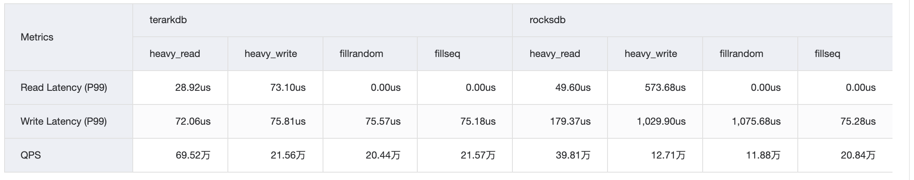
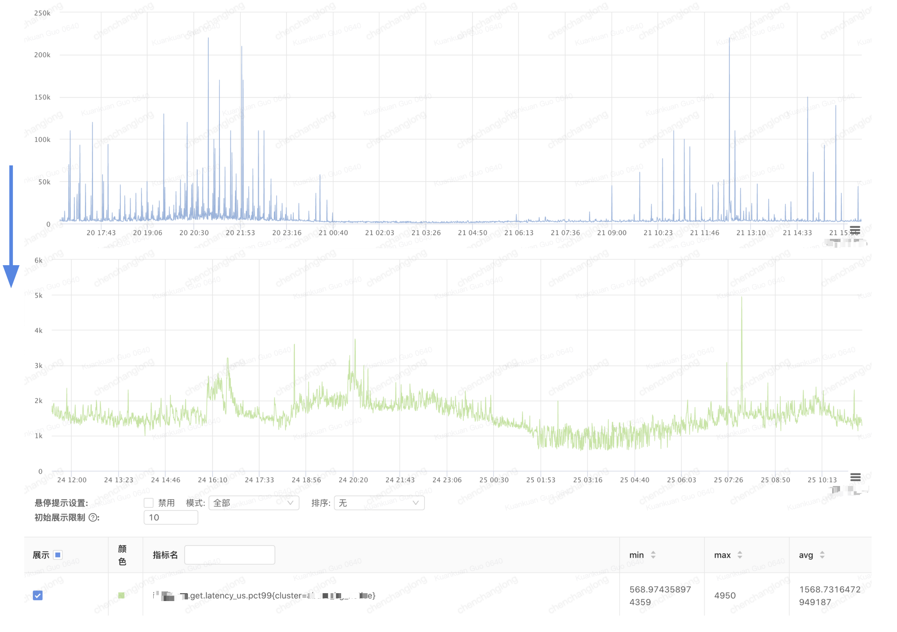

# 0. What is TerarkDB
TerarkDB is a RocksDB replacement with optimized tail latency, throughput and compression etc. In most cases you can migirate your existing RocksDB instance to TerarkDB without any
drawbacks.


**NOTES**
- TerarkDB was only tested and production ready under Linux platform
- Language bindings except C/C++ are not fully tested yet.
- Existing data can be migirated from RocksDB directly to TerarkDB, but cannot migrate back to RocksDB.
- TerarkDB was forked from RocksDB v5.18.3.


## Performance Overview
- RocksDB v6.12
- Bench Enviroment
  - use `db_bench`
  - 10 client threads, 20GB requests per thread
  - key = 24 bytes, value = 2000 bytes
  - `heavy_write` means 90% write operations
  - `heavy_read` means 90% read operations

### Documentation

[TerarkDB all-in-one Docs](https://bytedance.feishu.cn/docs/doccnZmYFqHBm06BbvYgjsHHcKc#)



<<<<<<< HEAD
## Full Document
[All-in-one Documentation](https://bytedance.feishu.cn/docs/doccnZmYFqHBm06BbvYgjsHHcKc#)


# 1. Use TerarkDB

## Method 1: Use CMake subdirectory (Recommend)

1) Clone

```
cd {YOUR_PROJECT_DIR}
git submodule add https://github.com/bytedance/terarkdb.git

cd terarkdb && git submodule update --init --recursive
```

2) Edit your Top Project's CMakeLists.txt

```
add_subdirectory(terarkdb)
target_link_libraries({YOUR_TARGET} terarkdb)
```

3) Important Default Options

- CMAKE_BUILD_TYPE: Debug
- WITH_JEMALLOC: ON
- WITH_TESTS: OFF
- WITH_TOOLS: OFF


### Notes
- TerarkDB is built with zstd, lz4, snappy, zlib, gtest, boost by default, if you need these libraries, you can remove them from your higher level application.


## Method 2: Link as static library

1) clone & build

```
git clone https://github.com/bytedance/terarkdb.git

cd terarkdb && git submodule update --init --recursive

./build.sh
```

2) linking

Directory:

```
  terarkdb/
        \___ output/
                \_____ include/
                \_____ lib/
                         \___ libterarkdb.a
                         \___ libzstd.a
                         \___ ...
```

We didn't archieve all static libraries together yet, so you have to pack all libraries to your target:

```
-Wl,-Bstatic \
-lterarkdb -lbz2 -ljemalloc -llz4 -lmetrics2 -lsnappy -lz -lterark-zip-r -lzstd \
-lboost_context -lboost_fiber -lboost_filesystem -lboost_system \
-Wl,-Bdynamic -pthread -lgomp -lrt -ldl -laio
```


# 2. Usage
## 2.1. BlockBasedTable
TODO

## 2.2. TerarkZipTable
TODO


# 3. Real-world Performance Improvement
TerarkDB has been deployed in lots of applications in Bytedance, in most cases TerarkDB can help to reduce overall latency and improve throughput tremendously.

### Disk Write


### Get Latency



# 4. Contributing
- TerarkDB uses Github issues and pull requests to manage features and bug fixes.
- All PRs are welcome including code formating and refactoring.


# 5. License
- TerarkDB uses the same license policy with original [RocksDB](https://github.com/facebook/rocksdb))
- Dual License: Apache2.0 and GPLv2

# 6. Users

Please let us know if you are using TerarkDB, thanks!

- ByteDance (core online services)
