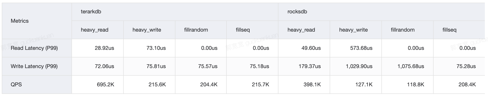
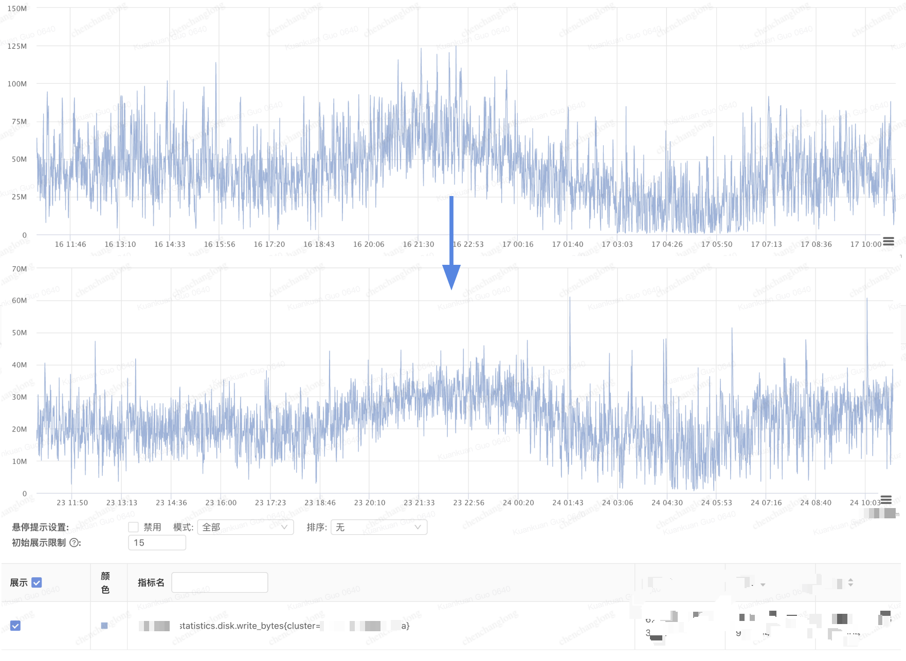
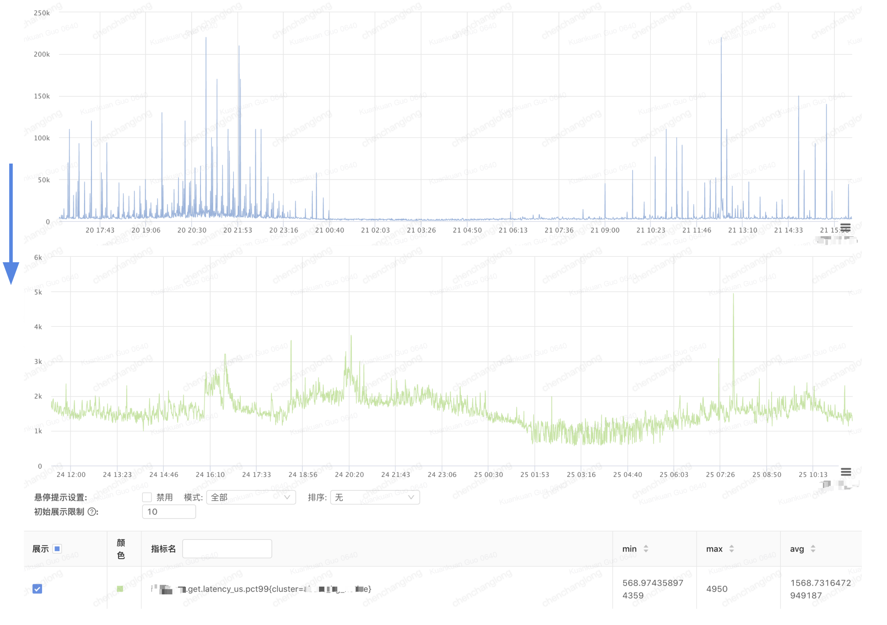

# About TerarkDB
TerarkDB is a RocksDB replacement with optimized tail latency, throughput and compression etc. In most cases you can migrate your existing RocksDB instance to TerarkDB without any
drawbacks.

- [All-in-one Docs](https://bytedance.feishu.cn/docs/doccnZmYFqHBm06BbvYgjsHHcKc#)
- [Slack Channel](https://join.slack.com/t/terarkdb/shared_invite/zt-zxo71hwl-j_K4OIQ~p5_SsT4RrFesxg)

**NOTES**
- TerarkDB was only tested and production ready under Linux platform
- Language bindings except C/C++ are not fully tested yet.
- Existing data can be migrated from RocksDB directly to TerarkDB, but cannot migrate back to RocksDB.
- TerarkDB was forked from RocksDB v5.18.3.


## Performance Overview
- RocksDB v6.12
- Server
  - Intel(R) Xeon(R) Gold 5218 CPU @ 2.30GHz (2 Sockets, 32 cores 64 threads)
  - 376 GB DRAM
  - NVMe TLC SSD (3.5 TB)
- Bench Tools & Workloads
  - use `db_bench`
  - 10 client threads, 20GB requests per thread
  - key = 24 bytes, value = 2000 bytes
  - `heavy_write` means 90% write operations
  - `heavy_read` means 90% read operations





# 1. Use TerarkDB

## Prerequisite
If you enabled TerarkZipTable support (`-DWITH_TERARK_ZIP=ON`), you should install `libaio` before compile TerarkDB:

`sudo apt-get install libaio-dev`

If this is your first time using TerarkDB, we recommend you to use without TerarkZipTable by changing `-DWITH_TERARK_ZIP` to `OFF` in `build.sh`.

## Method 1: Use CMake subdirectory (Recommend)

1) Clone

```
cd {YOUR_PROJECT_DIR}
git submodule add https://github.com/bytedance/terarkdb.git

cd terarkdb && git submodule update --init --recursive
```

2) Edit your Top Project's CMakeLists.txt

```
add_subdirectory(terarkdb)
target_link_libraries({YOUR_TARGET} terarkdb)
```

3) Important Default Options

- CMAKE_BUILD_TYPE: RelWithDebInfo
- WITH_JEMALLOC: ON
  - Use Jemalloc or Not (If you are using a different malloc library, change to OFF)
- WITH_TESTS: OFF
  - Build test cases
- WITH_TOOLS: OFF
  - Build with TerarkDB tools (e.g. db_bench, ldb etc)
- WITH_TERARK_ZIP: OFF
  - Build with TerarkZipTable
- WITH_ZNS: OFF
  - Build with ZNS device support


### Notes
- TerarkDB is built with zstd, lz4, snappy, zlib, gtest, boost by default, if you need these libraries, you can remove them from your higher level application.


## Method 2: Link as static library

1) clone & build

```
git clone https://github.com/bytedance/terarkdb.git

cd terarkdb && git submodule update --init --recursive

WITH_TESTS=OFF WITH_ZNS=OFF ./build.sh
```

2) linking

Directory:

```
  terarkdb/
        \___ output/
                \_____ include/
                \_____ lib/
                         \___ libterarkdb.a
                         \___ libzstd.a
                         \___ ...
```

We didn't archieve all static libraries together yet, so you have to pack all libraries to your target:

```
-Wl,-Bstatic \
-lterarkdb -lbz2 -ljemalloc -llz4 -lsnappy -lz -lzstd \
-Wl,-Bdynamic -pthread -lgomp -lrt -ldl -laio
```


# 2. Usage
## 2.1. BlockBasedTable
```c++
#include <cassert>
#include "rocksdb/db.h"

rocksdb::DB* db;
rocksdb::Options options;

// Your options here
options.create_if_missing = true;
options.wal_bytes_per_sync = 32768;
options.bytes_per_sync = 32768;

// Open DB
auto status = rocksdb::DB::Open(options, "/tmp/testdb", &db);

// Operations
std::string value;
auto s = db->Put(rocksdb::WriteOptions(), "key1", "value1");
s = db->Get(rocksdb::ReadOptions(), "key1", &value);
assert(s.ok());
assert("value1" == value);

s = db->Delete(rocksdb::WriteOptions(), "key1");
assert(s.ok());
```

Or manually set table format and table options:

```c++
#include <cassert>
#include "rocksdb/db.h"
#include "rocksdb/options.h"
#include "rocksdb/table.h"

rocksdb::DB* db;
rocksdb::Options options;

// Your db options here
options.create_if_missing = true;
options.wal_bytes_per_sync = 32768;
options.bytes_per_sync = 32768;

// Manually specify target table and table options
rocksdb::BlockBasedTableOptions table_options;
table_options.block_cache =
    rocksdb::NewLRUCache(32ULL << 30, 8, false);
table_options.block_size = 8ULL << 10;
options.table_factory = std::shared_ptr<rocksdb::TableFactory>
                          (NewBlockBasedTableFactory(table_options));

// Open DB
auto status = rocksdb::DB::Open(options, "/tmp/testdb2", &db);

// Operations
std::string value;
auto s = db->Put(rocksdb::WriteOptions(), "key1", "value1");
s = db->Get(rocksdb::ReadOptions(), "key1", &value);
assert(s.ok());
assert("value1" == value);

s = db->Delete(rocksdb::WriteOptions(), "key1");
assert(s.ok());
```

## 2.2. TerarkZipTable
```c++
#include <cassert>
#include "rocksdb/db.h"
#include "rocksdb/options.h"
#include "rocksdb/table.h"
#include "table/terark_zip_table.h"

rocksdb::DB* db;
rocksdb::Options options;

// Your db options here
options.create_if_missing = true;
options.wal_bytes_per_sync = 32768;
options.bytes_per_sync = 32768;

// TerarkZipTable need a `fallback` options because you can indicate which LSM level you want to start using TerarkZipTable
// For example, by setting tzt_options.terarkZipMinLevel = 2, TerarkDB will use your fallback Table on level 0 and 1.
std::shared_ptr<rocksdb::TableFactory> table_factory;
rocksdb::BlockBasedTableOptions blockbased_options;
blockbased_options.block_size = 8ULL << 10;
table_factory.reset(NewBlockBasedTableFactory(blockbased_options));

rocksdb::TerarkZipTableOptions tzt_options;
// TerarkZipTable requires a temp directory other than data directory, a slow device is acceptable
tzt_options.localTempDir = "/tmp";
tzt_options.indexNestLevel = 3;
tzt_options.sampleRatio = 0.01;
tzt_options.terarkZipMinLevel = 2; // Start using TerarkZipTable from level 2

table_factory.reset(
    rocksdb::NewTerarkZipTableFactory(tzt_options, table_factory));

options.table_factory = table_factory;

// Open DB
auto status = rocksdb::DB::Open(options, "/tmp/testdb2", &db);

// Operations
std::string value;
auto s = db->Put(rocksdb::WriteOptions(), "key1", "value1");
s = db->Get(rocksdb::ReadOptions(), "key1", &value);
assert(s.ok());
assert("value1" == value);

s = db->Delete(rocksdb::WriteOptions(), "key1");
assert(s.ok());
```


# 3. Real-world Performance Improvement
TerarkDB has been deployed in lots of applications in Bytedance, in most cases TerarkDB can help to reduce latency spike and improve throughput tremendously.

### Disk Write


### Get Latency (us)



# 4. Contributing
- TerarkDB uses Github issues and pull requests to manage features and bug fixes.
- All PRs are welcome including code formating and refactoring.


# 5. License
- Apache 2.0

# 6. Users

Please let us know if you are using TerarkDB, thanks! (By joining our slack channel)

- ByteDance (core online services)
